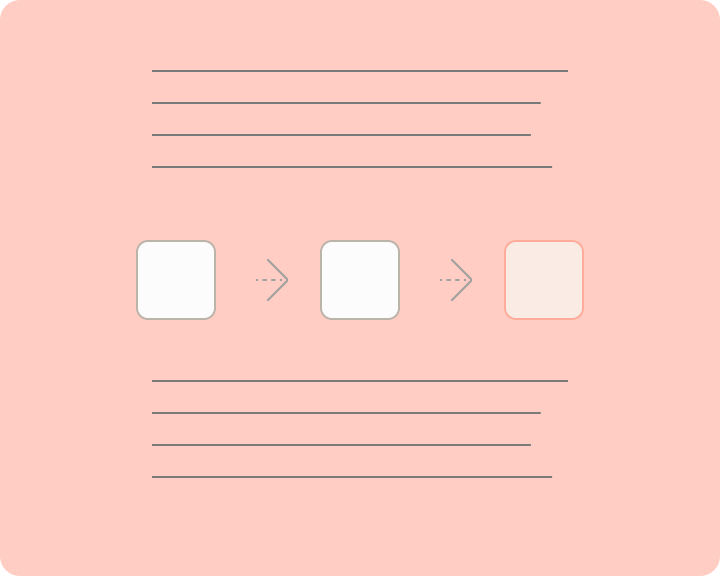
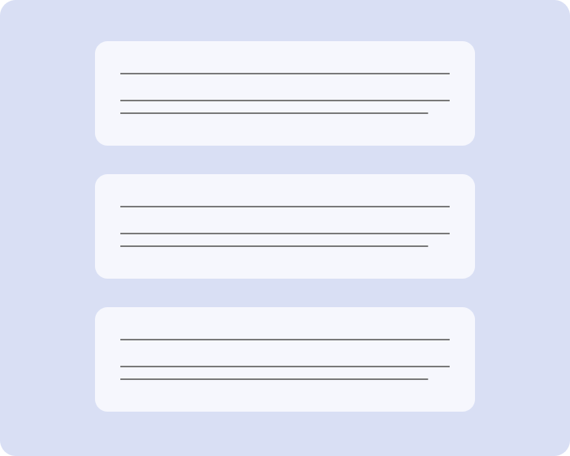
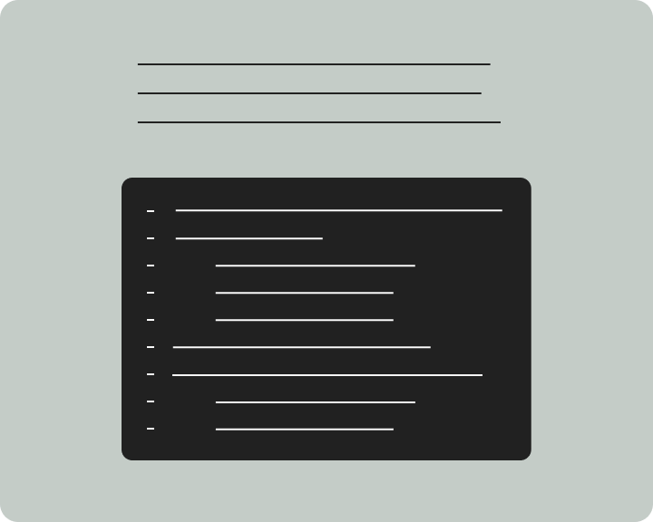

## GaiaHub's Documentation

 

> [!multi-column]
>
>> [!guides-and-concepts] Concepts
>> [[Guides/Concepts| GET STARTED →]]
>> 
>> Understand how nodes works
>
>> [!create-your-application] Create your application
>> [[Creating my First Chatbot| GET STARTED →]]
>> 
>> Integrate natural language processing and generation into your products with no coding
>
>> [!release-notes] Release notes
>> [[Guides/index| GET STARTED →]]
> > 
> > Keep up with the latest releases and platform updates from GaiaHub